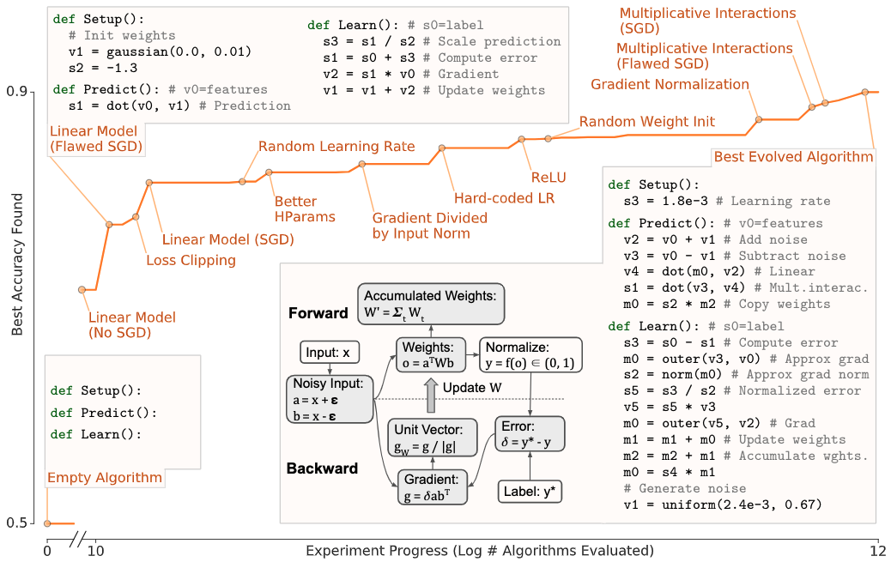

# AutoML-Zero Open-Sourced Code

This directory contains the open-sourced code for the paper:

\"**AutoML-Zero: Evolving Machine Learning Algorithms From Scratch**\" \
*Esteban Real\*, Chen Liang\*, David R. So, and Quoc V. Le. \(\*equal contribution)*

&nbsp;

## Evolving Algorithms with Minimal Human Bias

The paper presents experiments that automatically discover computer programs to solve machine learning tasks. Starting from empty or random programs and using only basic mathematical operations as building blocks, the evolutionary search method discovers linear regression, 2-layer fully connected neural networks, bilinear models, and the like. Backpropagation by gradient descent is discovered simultaneously as a way to train the models when the search process is made to evaluate on *multiple* tasks. In other words, searching the AutoML-Zero space discovers not only these simple architectures, but also the learning algorithm.

For example, one of our experiments evaluates on binary classification tasks extracted CIFAR-10. It produces the following sequence of discoveries:



In other words, AutoML-Zero aims to simultaneously search for all aspects of an ML algorithm, including the architecture, the data augmentation, and the learning strategy, all the while employing *minimal human bias*. To minimize biasing the results in favor of human-discovered ideas, we search over large sparse spaces that have not been heavily designed, using fine-grained components (e.g. 58 basic mathematical ops) and imposing minimal restrictions on form&mdash;i.e directly evolving the code. As an example of the code, here are the initial algorithm and the best algorithm discovered by the experiment above:


There are few restrictions in that every instruction inside each of the three component functions above is free to change during the search: instructions can be inserted or removed, their arguments and output variables can be modified, and the operations used to combine those arguments can be altered. We even allow a variable number of instructions. This code performs better than hand-designs of comparable complexity, such as logistic regressors or two-layer preceptrons. This remains the case even after transferring to other datasets like SVHN or down-sampled ImageNet. Most importantly, the evolved code is *interpretable*: our paper analyzes this model in terms of multiplicative interactions, gradient descent, and similar concepts.


&nbsp;

## Quick 5-Minute Demo: Rediscovering Linear Regression from Scratch

As a quick demo, we provide a script that runs a
local evolution experiment to search for algorithms that can solve multiple linear tasks. Typically, it will discover linear regression by gradient descent in under 5 minutes using 1 CPU.

To reduce resource usage, we simplified the setting: the code is restricted to short programs of fixed length and the allowed ops are only those necessary for a linear regressor (i.e. a much smaller search space than most of the paper).

The demo will run short evolution experiments in succession on the *search
tasks* (see paper) and evaluate the best algorithm discovered by each
experiment on the *selection tasks*. Once an algorithm attains a
fitness (1 - RMS error) greater than 0.9999, it is selected for a final
evaluation on unseen data. To conclude, the demo prints the results of this
one-time final evaluation and shows the code for the corresponding algorithm.

Please install with:

```
TODO(crazydonkey): add command lines.
```

and run with:

```
TODO(crazydonkey): add command lines.
```

Repeated runs will use different random seeds. Note that the runtime may vary
widely due to the random initial conditions and hardware.

&nbsp;

## Reproducing Baselines

The following command can be used to reproduce the results in Supplementary
Section 9 ("Baselines") with the "Basic" method on 1 process (1 CPU):

*[To be continued, ETA: March, 2020]*

If you want to use more than 1 process, you will need to code a way to
parallelize the computation based on your particular distributed-computing
platform. A platform-agnostic description of what we did is given in our paper.

We left out of this directory upgrades for the "Full" method that are
pre-existing (hurdles) but included those introduced in this paper (e.g. FEC
for ML algorithms).

&nbsp;

<sup><sub>
Search keywords: machine learning, neural networks, evolution,
evolutionary algorithms, regularized evolution, program synthesis,
architecture search, NAS, neural architecture search,
neuro-architecture search, AutoML, AutoML-Zero, algorithm search,
meta-learning, genetic algorithms, genetic programming, neuroevolution,
neuro-evolution.
</sub></sup>
